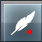
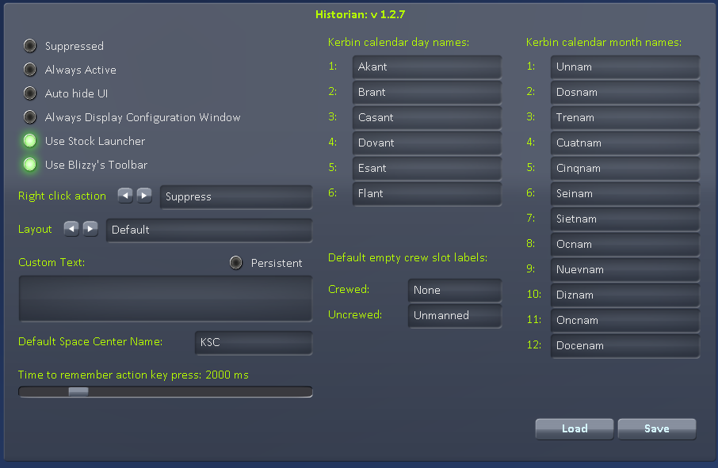

# Configuration

To open the configuration dialog window click on the Historian Icon in the main AppLauncher area . Clicking the button a second time will close the configuration dialog.

* __Suppressed__: Historian will not display any overlay when you take a screenshot.
* __Always Active__: The overlay will always show on top of the game window. This is useful when editting layouts.
* __Auto Hide UI__: Historian will hide the UI (equivalent to pressing F2) whenever a screenshot is taken with the F1 key. Note: if you are using another mod that also tries to hide the UI (e.g. Automated Screenshots & Saves) then it is recommended you leave this option unset.
* __Use Stock Launcher__: Display an Historian button in the stock app launcher toolbar
* __Use Blizzy's Toolbar__: An Historian button will be available to be added to Blizzy's Toolbar.
    * __Right click action__: cycle through which option (Suppressed, AlwaysActive or AutoHideUI) to toggle when you right click on the Historian button in the Blizzy Toolbar. 
* __Layout__: allows you to cycle through the available layouts (see [Layouts](layouts.md)) to choose which is active
* __Custom Text__: A formatted text string used by the `<custom>` tag. (See [Tags](Tags.md)). The content will be cleared whenever a screenshot is taken unless the `Persistent` option is active.
* __Default Space Center Name__: A preferred name to use when a [tag](Tags.md) returns "KSC"
* __Time to remember action key press__: The time that pressing an action key (e.g. Space, 1, 2 etc.) will be remembered for use in an [`ACTION_TEXT`](Action_Text.md) element.
* __Default empty crew slot labels__: apply to the various crew tags. See the {Crew Tags}(Tags-Crew.md) for more details.
* __Kerbin calendar day names__: edit the expanded day name values used when formatting dates in various [date tags](Tags-Date.md)
* __Kerbin calendar month names__: edit the expanded month name values used when formatting dates in various [date tags](Tags-Date.md)

* __Load__: Reloads all layouts. Useful when editting layouts.
* __Save__: Saves the current setings and close the window.

__Note__: The configuration window shows up even if you have GUI disabled using the 'F2' key. This is intentional to allow layout editting while the game GUI is off.

--
### [Documentation Index](../README.md)