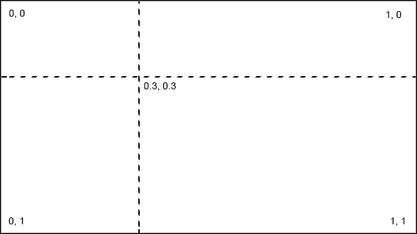
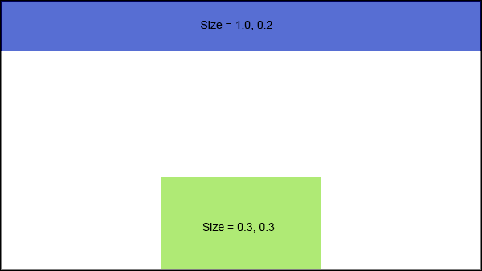
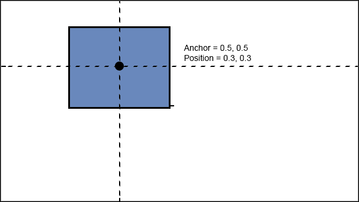

# Layout File Common Properties

## `Name`

Declare a name to identify the element. Used by [INHERIT](Inherit.md) elements when creating merged layouts. All the names used in a layout (or set of inherited layouts) must be unique.

_Example: `Name = BigPicture`_

All elements can have properties defining defining their position and size on the screen expressed as fractions of the total screen size.

## `Position` 

Defines the position of the element relative to the top left of the screen.

_Example: `Position = 

__If omitted then the default value of 0.0, 0.0 is used__

## `Size`

The width and height relative as fractions of total width and height.

__If omitted then the default value of 0.0, 0.0 is used__

## `Anchor`

The origin point of the element expressed relative to itself. This is the point that `Position` above defines. For example using Anchor = 0.5, 0.5 will locate the centre of the element at the defined position.

__If omitted then the default value of 0.0, 0.0 is used__

--
### [Documentation Index](../README.md)
