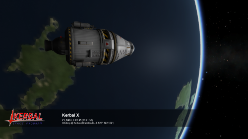

# Layout Files

**IMPORTATNT NOTE: Unless stated otherwise all parts of the layout file are case sensitive but spaces are generally optional.**

All Historian layout files must be located inside `<KSP Root>/GameData/Historian/Layouts` folder, and must have a `.layout` extension to be recognized by Historian. Even though the files have a `.layout` extension, they are plain text files following the same syntax as KSP's `*.cfg` files. The use of a different filetype is to prevent the game from loading them into the database by default. You can edit these files using your favorite text editor.

Several example layouts are included with Historian by default.

To create a new layout create an empty text file and name it `<Layout Name>.layout`. Where <Layout Name> is whatever you want to call it. Make sure the file has a `*.layout` extension

To modify a layout, simply open it in any text editor.

The content of the layout file must follow the pattern:

	KSEA_HISTORIAN_LAYOUT
	{
		Name = <Your layout's unique name>
		
		<Element>
		{
		}
		
		<Element>
		{
		}
	}

Every layout starts with `KSEA_HISTORIAN_LAYOUT` and __MUST__ have a unique name.

The available type of <Element> blocks are listed in the [Layout Elements](Layout-Elements.md) page:

## Example

	KSEA_HISTORIAN_LAYOUT
	{
		Name = Default

		// Draw a semi-transparent black bar across the bottom half of the screen
		RECTANGLE
		{
			Name = BackgroundPanel
			Anchor = 0.0,0.5
			Size = 1.0,0.125
			Position = 0.0,0.85
			Color = 0.0,0.0,0.0,0.5
		}

		// Draw the vessel's flag near the left edge of the black bar
		FLAG
		{
			Name = SmallFlag
			Anchor = 0.5,0.5
			Position = 0.1,0.85
			Scale = 1,1
			DefaultTexture = Squad/Flags/default
		}

		// Show three lines of white text with various values relating to the current vessel (see tags section for details)
		TEXT
		{
			Name = DetailText
			Anchor = 0.0,0.5
			Position = 0.25,0.85
			Size = 0.5,0.1
			Color = 1.0,1.0,1.0,1.0
			Text = <size=22><b><Vessel></b></size><N><size=8><N></size><b><UT></b> (<T+>)<N><size=12><Situation> @ <Body> (<Biome>, <Latitude>° <Longitude>°) </size>
			TextAnchor = MiddleLeft
			FontSize = 12
			FontStyle = Normal
		}
	}

### The result:

[Full size](Default.png)

--
### [Documentation Index](../README.md)