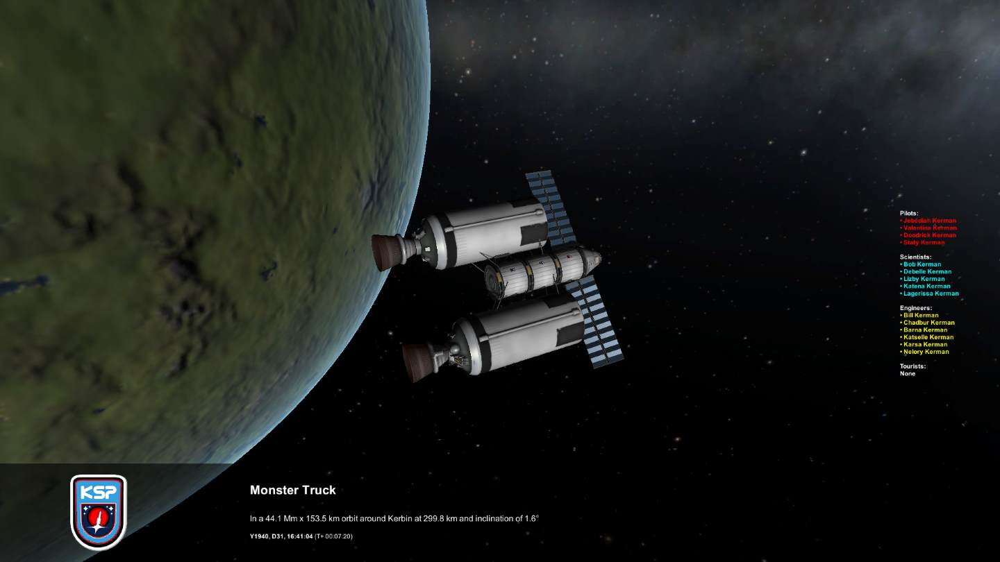
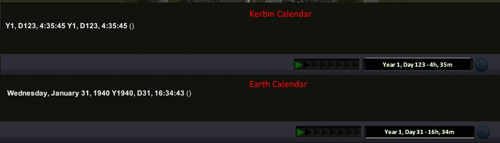
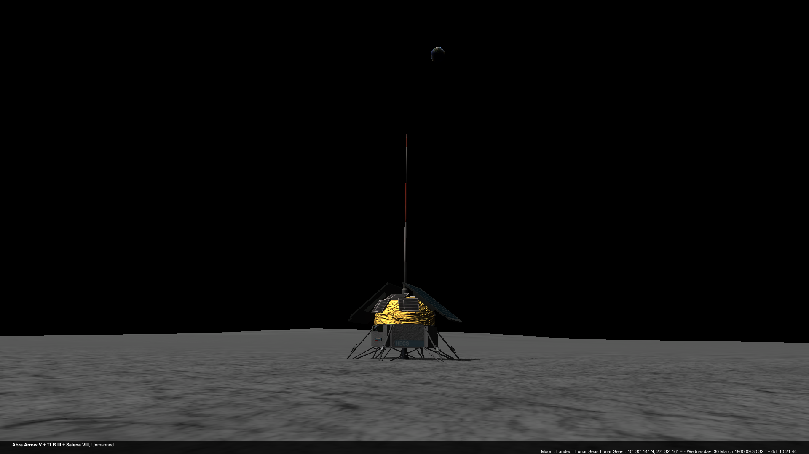

# Historian-Expanded /L Unleashed

Small utility for adding information to KSP screenshots.

[Unleashed](https://ksp.lisias.net/add-ons-unleashed/) fork by Lisias.

## Slide 1

The vertical list variants of the crew tags are really useful for large ships and stations  is the horizontal version  for vertical.

## Slide 2

Notably heading and separated (and coloured) crew profession lists

## Slide 3

## Slide 4

## Slide 5

